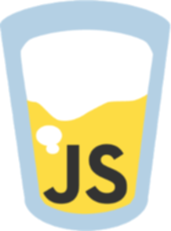

# JavaScript - The weird parts

---

## Our Presenters

## David Luecke

* GitHub: [daffl.github.com](http://daffl.github.com), Twitter: [@daffl](http://twitter.com/daffl)

## Eric Kryski

* GitHub: [ekryski.github.com](http://ekryski.github.com), Twitter: [@ekryski](http://twitter.com/ekryski)

Presentation:

- [yycjs.com/the-weird-parts](http://yycjs.com/the-weird-parts)

Codecast:

- [jsbin.com/zino/watch](http://jsbin.com/zino/4/watch)

---

## Our Sponsors

## Assembly Co-working Space

## PetroFeed

---

## Our Sponsors

## Village Brewery

---

## Last Year

* [Becoming an Open Source, JavaScript, Hipster 101](https://github.com/yycjs/open-source-intro)
* [jQuery, Templating, and Build Tools. Oh My!](https://github.com/yycjs/jquery-templates-builds)
* [Node Up! Server side JavaScript FTW!](https://github.com/yycjs/node-up)
* [NodeJS Auth & Structure](https://github.com/yycjs/node-auth-structure)
* [Client Side MVWTF](https://github.com/yycjs/mvwtf)
* [It's all about the tests, Yo!](https://github.com/yycjs/javascript-testing)
* [Module Loading & Generators](https://github.com/yycjs/module-loading-generators)
* [SEO & i18n](https://github.com/yycjs/seo-i18n)
* [Mobile madness](https://github.com/yycjs/mobile-madness)
* [YYCJSCamp](https://github.com/yycjs/YYCJSCamp-2013)

---

## You know?

- [__O__bject __O__riented __P__rogramming](http://en.wikipedia.org/wiki/Object-oriented_programming) basics (classes, objects, inheritance)
- JavaScript language basics
    - __Operators__ `[]`, `&&`, `==`, `||` 
    - __Arrays__ and __Objects__ `[].push`, `{}`
    - __Functions__ `var fn = function(param1, param2) {}` 
- Some jQuery
    - __Selectors__ `tagname`, `#myId`, `.class`
    - __Event handlers__ `$('selector').click(function() { alert('clicked'); })`

---

## Welcome to the weird side

- functions
- truthy and falsyness
- Equality
- Scope
- `this`
- Prototypes
- Asynchronous programming
- ECMAScript 5 and 6

---

## Warm up...

Accessing object properties

    !javascript
    var person = {
      name: 'david',
      '&weird property': 'YYCJS'
    }

    person.name // -> David
    person['name'] // -> David
    person["name"] // -> David
    person['&weird property'] // -> YYCJS

    // ERROR
    person.&weird property

---

## Functions and `arguments`

Functions are treated just like any other variable:

    !javascript
    var myFunction = function(arg) {

    }
    // the same as
    function myFunction(arg) {

    }

`arguments` is a special array-like variable that contains all parameters passed to the function call:

    !javascript
    function sum() {
        var sum = 0;
        for(var i = 0; i < arguments.length; i++) {
            sum += arguments[i];
        }
        return sum;
    }

    sum(1, 2, 3, 4); // -> 10

---

## Truthy- and falsyness

__Truthyness__

    !javascript
    var person = { name: 'David' }
    
    if(person.name) {
      // Do stuff if property exists
    }

    if(1 == 1) {

    }

__Falsy values__

    !javascript
    false
    null
    undefined
    0
    ''
    person.undefinedProperty

---

## Equality or `==` vs `===`

`==` and `!=` compare the value

    !javascript
    1 == 1 // -> true
    1 == '1' // -> true
    1 == 2 // -> false

    // Now things get weird
    '' == false // -> true
    [] == false // -> true
    null == undefined // -> true

`===` and `!==` compare value _and_ type

    !javascript
    1 === 1 // -> true
    1 === '1' // -> false
    1 === parseInt('1') // -> true
    [] === false // -> false
    null === undefined // -> false

### ALWAYS USE ===

---

## Scope in JavaScript

JavaScript only knows function scope and can access all variables from its parent scopes:

    !javascript
    var x = 'outer';
    function count() {
        for(var i = 0; i < 10; i++) {
            var x = 'testing';
            var inner = function() {
                var y = 42;
            }

            inner();
        }
    }

    count();

---

## Global variables

Variables declared without `var` will automatically become global

    !javascript
    function test() {
        var local = 42;
        global = 'global';
    }

    test();

You probably never want that.

If you do, add and access them through the `window` object (browsers) explicitly:

    !javascript
    function test() {
        var local = 42;
        window.global = 'global';
    }

    test();

---

## Closures

Introduce a new scope by passing variables to a wrapper function.

    !javascript
    for(var i = 0; i < 10; i++) {
        var button = $('<button>Button #' + i + '</button>');
        var wrapper = function(counter) {
            button.click(function() {
                alert(counter);
            });
        }
        
        wrapper(i);
        $('body').append(button);
    }

---

## What is `this`?

In JavaScript `this` refers to the _owner_ of the function you are calling, e.g. with

__Objects__

    !javascript
    var person = {
        name: 'David',
        sayHi: function() {
            alert('Hello ' + this.name);
        }
    }

    person.sayHi();

__jQuery__

    !javascript
    $('button').click(function() {
        this.html('Button clicked');
    });

---

## The Trinity of `this`

There are three rules for what `this` can be:

1) __The object__, when the function is called on an object

    !javascript
    person.sayHi()

2) A function is called with the `new` operator

    !javascript
    new Dog('Goofy');

3) The owner has been changed with [call](https://developer.mozilla.org/en-US/docs/Web/JavaScript/Reference/Global_Objects/Function/call), [apply](https://developer.mozilla.org/en-US/docs/Web/JavaScript/Reference/Global_Objects/Function/apply) or [bind](https://developer.mozilla.org/en-US/docs/Web/JavaScript/Reference/Global_Objects/Function/bind).

    !javascript
    sayHi.call(owner, arg1, arg2);
    sayHi.apply(owner, argsArray);

    var boundSayHi = sayHi.bind(owner);

Otherwise `this` will be the global (`window`) object (or `undefined` in strict mode).

---

## `this` and callbacks

Callbacks are used for asynchronous operations (the A in Ajax). 

Always remember that in the callback you will loose the original `this`:

    !javascript
    $('button').click(function() {
        // Store the old this reference (the clicked button)
        var self = this;

        $.getJSON('someFile.json', function(data) {
            // Set the button content
            self.html(data.text);
        });
    });

___

# Prototypes

---

## Classes vs. Prototypes

---

## JavaScript only knows objects

Inheritance by pointing an objects prototype to another object.

    !javascript
    var Animal = function() {
        this.sound = 'blubb';
    }

    Animal.prototype.makeSound = function() {
        return this.sound + '!';
    }

    var Dog = function() {
        this.sound = 'Woof';
    }

    Dog.prototype = new Animal();

    var Cat = function() {
        this.sound = 'Meow';
    }

    Cat.prototype = new Animal();

---

## Overriding existing methods

If you want to overwrite an existing method but use the old result you
need to `call` or `apply` the old function with the current `this` reference and `arguments`:

    !javascript
    Dog.prototype.makeSound = function() {
        var oldSound = Animal.prototype.makeSound.apply(this, arguments);
        return this.sound + ' ' + oldSound;
    }

    var goofy = new Dog();
    var garfield = new Cat();

    alert(goofy.makeSound());
    alert(garfield.makeSound());

---

## The true ECMAScript 5 way

Uses only objects and inherits with `Object.create(prototypeObject)`

    !javascript
    var Animal = {
        sound: 'blubb',
        makeSound: function() {
            return this.sound + '!';
        }
    }

    var Dog = Object.create(Animal);
    var Cat = Object.create(Animal);

    Dog.sound = 'woof';
    Cat.sound = 'meow';

    var goofy = Object.create(Dog);
    var garfield = Object.create(Cat);

    alert(goofy.makeSound());
    alert(garfield.makeSound();

---

## This year

We will try to make all meetups available online (but lure you to come out with swag, pizza and beverages).

From now on meetups will be split into two parts:

1. The First 1 hour block will be on beginner topics (basic JavaScript, jQuery, CSS, HTML)
2. The Second 1 hour block will be on a (related) advanced topic

---

## Thursday, March 27th 2014

1. jQuery 202

    - Un-spaghetti and modularize your code
    - Adanced selectors and DOM traversal
    - Making your code faster
    - Writing your own plugins

2. Web components - the future of web development

    - Introduction to web components with Polymer
    - Data driven views
    - Build web components now with CanJS
